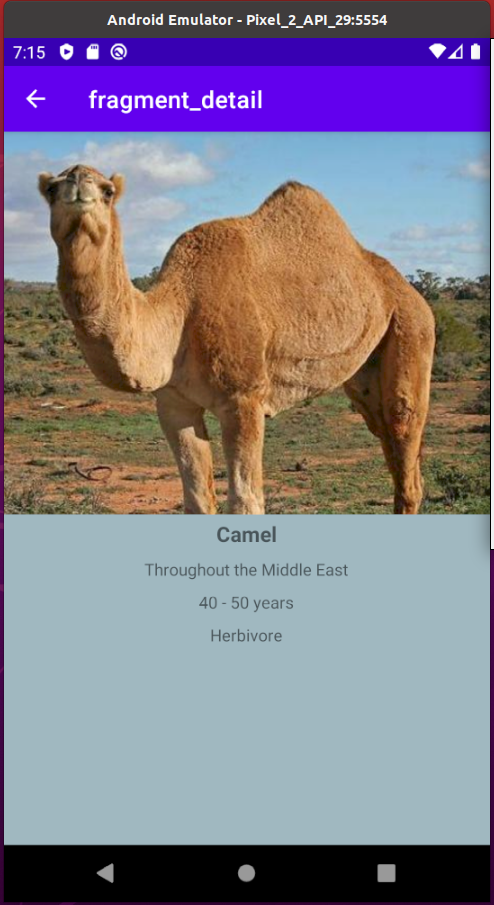

# Kotlin MVVM-architecture

## Main concepts in this application:

- MVVM architecture using the Google recommended Android Lifecycle Extensions

- Retrofit and JSON for remote server communication
  
- RxJava as a reactive framework
  
- Dagger2 for dependency injection
  
- Jetpack navigation for navigating the user through the app screens
  
- Jetpack Data Binding for building UI screens
  
- Glide for seamless image loading
  
- Jetpack Palette for extracting colors from images
  
- Unit tests to test the application and make it stable and robust (Mockito framework)

---

## Code Source:
* [The project structure](https://github.com/danyramirezg/kotlin-MVVM-architecture/tree/master/app/src/main/java/com/dany/kotlin_mvvm_architecture)
* [The tests](https://github.com/danyramirezg/kotlin-MVVM-architecture/tree/master/app/src/test/java/com/dany/kotlin_mvvm_architecture)

## Screenshots app:

